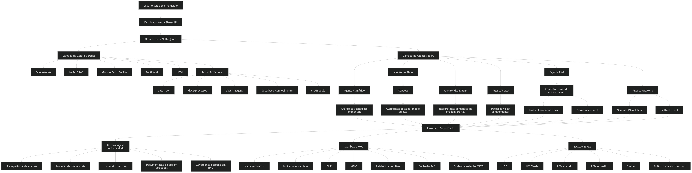
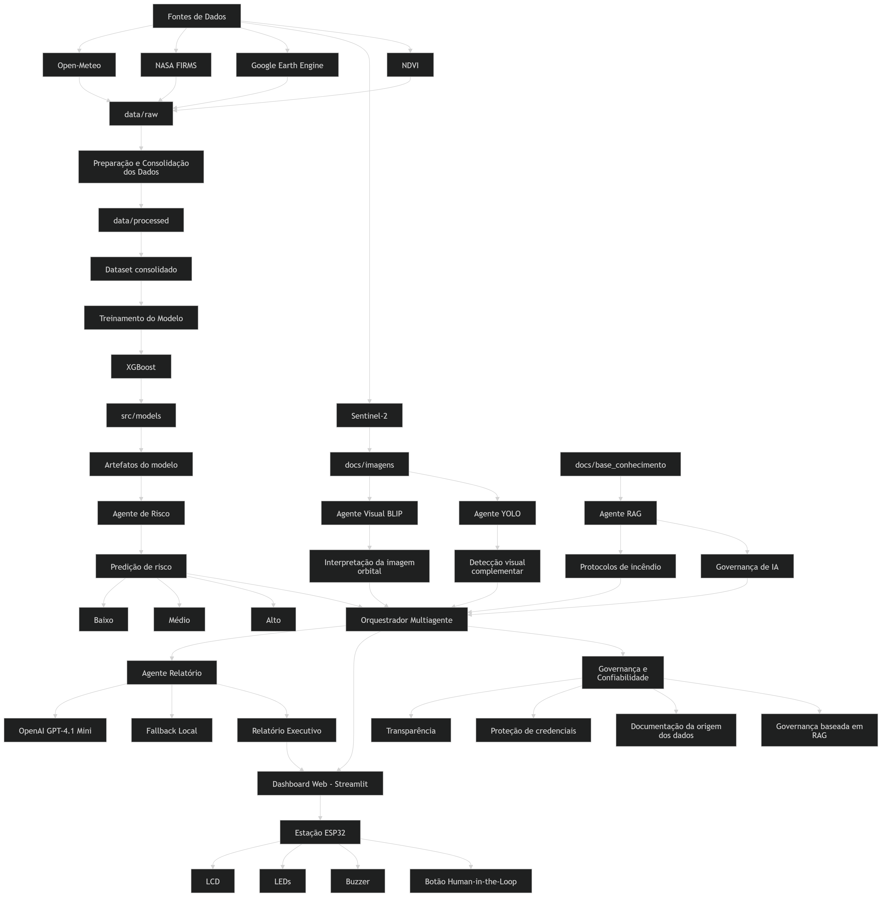
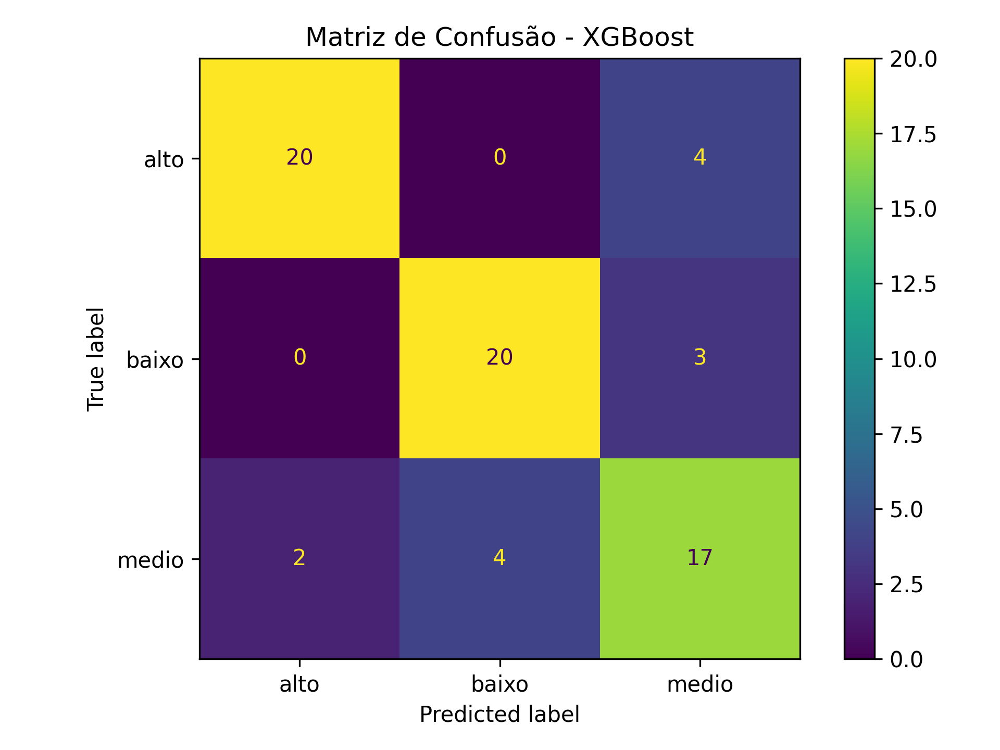
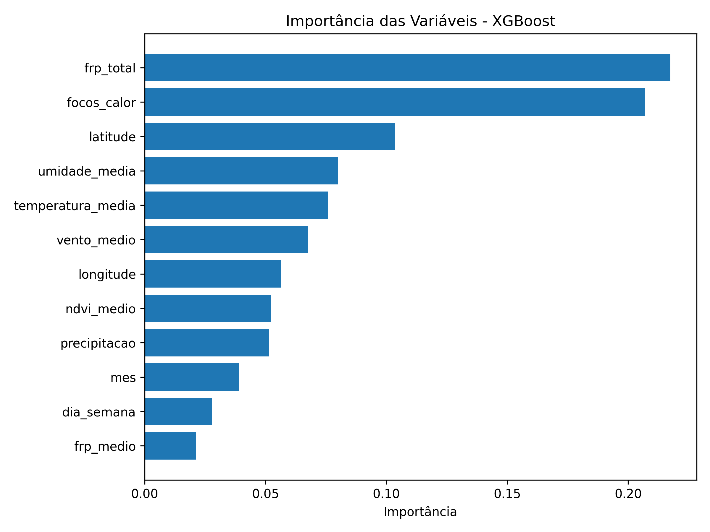

# FIAP - Faculdade de Informática e Administração Paulista

<p align="center">
  <a href="https://www.fiap.com.br/">
    
  </a>
</p>

# 🔥 Sentinela Orbital IA

## **Sistema Multiagente para Monitoramento e Prevenção de Incêndios Florestais na Amazônia e Pantanal**

---

## 👨‍💻 Equipe de Desenvolvimento

### Integrantes

- [Luana Porto Pereira Gomes](https://www.linkedin.com/in/luana-porto-pereira-gomes/)
- [Luma Oliveira](https://www.linkedin.com/in/luma-x)
- [Priscilla Oliveira](https://www.linkedin.com/in/priscilla-oliveira-023007333/)
- [Paulo Bernardes](https://www.linkedin.com/in/paulobernardesqs)

---

## 👩‍🏫 Professores

### Tutor

- [Leonardo Ruiz](https://www.linkedin.com/in/leonardoorabona/)

### Coordenador

- [André Godoi](https://www.linkedin.com/in/profandregodoi/)

---

# 📜 Sobre o Projeto

O **Sentinela Orbital IA** é uma plataforma inteligente de monitoramento ambiental desenvolvida para apoiar a prevenção e o monitoramento de incêndios florestais em regiões prioritárias da Amazônia e do Pantanal.

A solução integra dados climáticos do Open-Meteo, focos de calor do NASA FIRMS, índices de vegetação calculados via Google Earth Engine, imagens orbitais Sentinel-2, visão computacional com BLIP e YOLO, modelo preditivo XGBoost, arquitetura multiagente, recuperação de conhecimento via RAG e geração automática de relatórios utilizando OpenAI.

Os resultados são apresentados em um Dashboard Web desenvolvido com Streamlit e em uma estação local simulada com ESP32 no Wokwi, permitindo apoio à tomada de decisão e monitoramento ambiental de forma transparente e explicável.

---

# 🎯 Objetivo

Desenvolver uma solução capaz de:

- Monitorar indicadores ambientais em tempo real.
- Avaliar risco de incêndios florestais.
- Processar imagens orbitais.
- Aplicar visão computacional para análise complementar.
- Gerar relatórios executivos automatizados.
- Disponibilizar informações por meio de Dashboard Web.
- Simular alertas locais utilizando ESP32.

---

# 🌎 Municípios Monitorados

O sistema monitora nove municípios selecionados com base no histórico recente de focos de calor e relevância ambiental:

- **Amazônia**: Altamira (PA), Apuí (AM), Lábrea (AM), Novo Progresso (PA), Porto Velho (RO)
- **Pantanal**: Corumbá (MS), Porto Murtinho (MS), Poconé (MT), Barão de Melgaço (MT)

---

# 🏗 Arquitetura da Solução

O Sentinela Orbital IA foi desenvolvido utilizando uma arquitetura modular orientada a agentes especializados. Cada agente é responsável por uma etapa específica da análise, permitindo escalabilidade, rastreabilidade e transparência na tomada de decisão.

<p align="center">
    
</p>

---

# 🔄 Pipeline de Dados

O pipeline integra coleta, processamento, aprendizado de máquina, visão computacional, recuperação de conhecimento e geração de relatórios executivos.

<p align="center">
    
</p>

---

# 🧠 Tecnologias Utilizadas

## Dados e Sensoriamento

- ✅ Open-Meteo
- ✅ NASA FIRMS
- ✅ Google Earth Engine
- ✅ Sentinel-2
- ✅ NDVI

## Inteligência Artificial

- ✅ XGBoost
- ✅ BLIP
- ✅ YOLOv8
- ✅ OpenAI GPT-4.1 Mini
- ✅ RAG (Retrieval Augmented Generation)

## Arquitetura Multiagente

- ✅ Agente Climático
- ✅ Agente de Risco
- ✅ Agente Visual BLIP
- ✅ Agente YOLO
- ✅ Agente RAG
- ✅ Agente Relatório
- ✅ Agente Orquestrador

## Dashboard e Visualização

- ✅ Streamlit
- ✅ Plotly
- ✅ Folium

## IoT

- ✅ ESP32
- ✅ LCD
- ✅ LEDs de Alerta
- ✅ Buzzer
- ✅ Human-in-the-Loop

## Governança e Confiabilidade

- ✅ Transparência da análise
- ✅ Fallback Local
- ✅ Human-in-the-Loop
- ✅ Proteção de Credenciais
- ✅ Governança baseada em RAG
- ✅ Documentação da origem dos dados

---

# 📁 Estrutura do Projeto

```text
Sentinela-Orbital-IA
│
├── .streamlit/
│   └── config.toml
│
├── assets/
│   └── logo-fiap.png
│
├── data/
│   ├── external/
│   ├── processed/
│   └── raw/
│
├── docs/
│   ├── arquitetura/
│   ├── base_conhecimento/
│   ├── diagramas/
│   └── imagens/
│
├── src/
│   ├── agents/
│   ├── api/
│   ├── dashboard/
│   ├── esp32/
│   ├── ml/
│   └── models/
│
├── .env
├── .gitignore
├── README.md
└── requirements.txt
```

---

# ⚙ Funcionamento da Solução

### 1. Seleção do Município

O usuário escolhe um dos municípios monitorados pelo Dashboard.

### 2. Coleta de Dados

O sistema consulta:

- Open-Meteo (dados climáticos)
- NASA FIRMS (focos de calor)
- Google Earth Engine
- Sentinel-2

### 3. Processamento

Os dados são consolidados e preparados para análise.

### 4. Predição

O modelo XGBoost estima o risco de incêndio:

- Baixo
- Médio
- Alto

### 5. Interpretação Visual

As imagens orbitais são avaliadas pelos agentes:

- BLIP
- YOLO

### 6. Recuperação de Conhecimento

O Agente RAG consulta protocolos operacionais e documentos de governança.

### 7. Consolidação

O Orquestrador integra os resultados produzidos pelos agentes.

### 8. Relatório Executivo

O Agente Relatório utiliza OpenAI e fallback local para geração textual.

### 9. Visualização

Os resultados são apresentados no Dashboard Web.

### 10. Alerta Local

O ESP32 simula uma estação de alerta utilizando LCD, LEDs e buzzer.

---

# 📚 Base de Conhecimento e Governança

O sistema utiliza uma base local de conhecimento para suporte às recomendações e critérios de governança.

```text
docs/base_conhecimento/
├── governanca_ia.txt
└── protocolos_incendio.txt
```

Esses documentos são consultados pelo Agente RAG para enriquecer as análises e recomendações apresentadas ao usuário.

---

# 🛡 Governança e Uso Responsável

O Sentinela Orbital IA foi desenvolvido seguindo princípios de IA Responsável.

Principais práticas adotadas:

- Uso de dados provenientes de fontes públicas e reconhecidas.
- Separação entre coleta, processamento e apresentação.
- Não versionamento de credenciais.
- Uso de variáveis de ambiente para chaves de API.
- Registro da origem dos dados utilizados.
- Transparência na geração dos resultados.
- Human-in-the-Loop para apoio à decisão.
- Uso de RAG para recuperação de protocolos.
- Fallback local para continuidade operacional.

---

# 📊 Resultados Obtidos

O modelo XGBoost alcançou aproximadamente:

- Accuracy: 81%
- Precision Média: 82%
- Recall Médio: 81%
- F1-Score Médio: 81%

O modelo apresentou desempenho satisfatório para um cenário acadêmico de classificação multiclasses (baixo, médio e alto risco), demonstrando capacidade de apoiar processos de monitoramento preventivo e análise de risco ambiental.

### Matriz de Confusão

<p align="center">
    
</p>

### Importância das Variáveis

<p align="center">
    
</p>

---

# 🚀 Demonstração

### Dashboard Web

https://sentinela-orbital-ia.streamlit.app/

### Simulação ESP32 (Wokwi)

https://wokwi.com/projects/466330583730476033

### Repositório GitHub

https://github.com/Priangelini/Sentinela-Orbital-IA

### Vídeo Demonstrativo

[▶ Assistir demonstração](https://youtu.be/SEU_VIDEO)

---

# 🔧 Como Executar Localmente

## 1. Clonar o Repositório

```bash
git clone https://github.com/Priangelini/Sentinela-Orbital-IA.git
```

```bash
cd Sentinela-Orbital-IA
```

## 2. Criar Ambiente Virtual

```bash
python -m venv venv
```

Windows:

```bash
venv\Scripts\activate
```

Linux/Mac:

```bash
source venv/bin/activate
```

## 3. Instalar Dependências

```bash
pip install -r requirements.txt
```

## 4. Configurar Variáveis de Ambiente

Criar um arquivo `.env` na raiz do projeto:

```env
OPENAI_API_KEY=sua_chave_openai
NASA_FIRMS_MAP_KEY=sua_chave_nasa_firms
```

## 5. Executar o Dashboard

```bash
streamlit run src/dashboard/app.py
```

---

# 📄 Licença

Projeto acadêmico desenvolvido para a disciplina **Global Solution 2026 – FIAP**.

Uso exclusivamente educacional.
